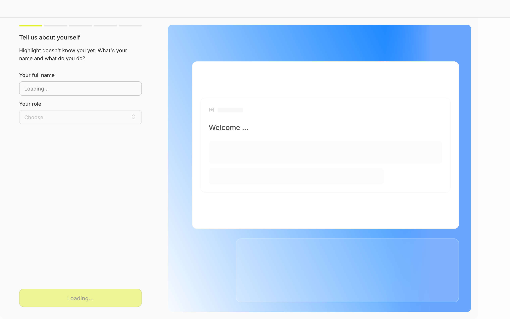
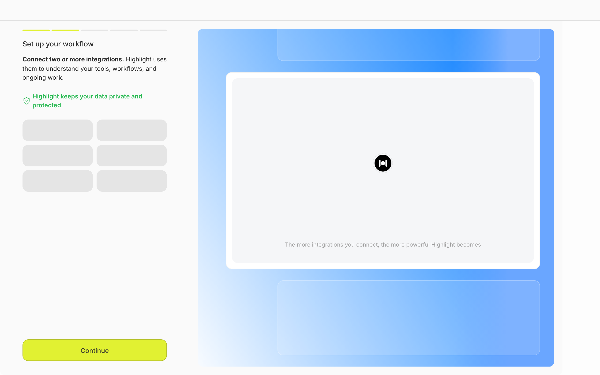
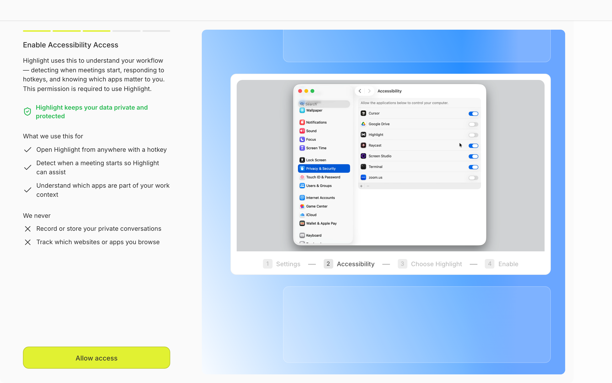
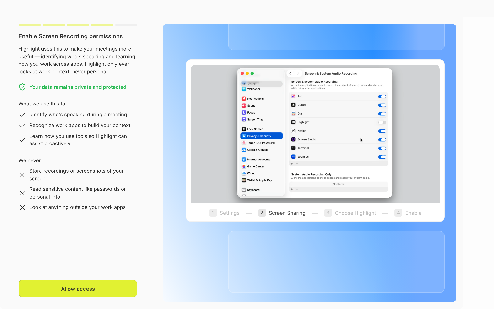
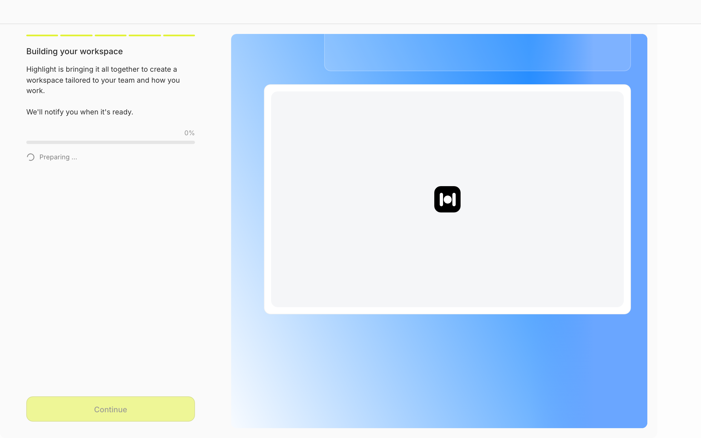

# Design Research: Highlight Desktop Onboarding Aesthetics

## TL;DR

The current onboarding has solid bones (2-pane layout, stepper, well-considered permission priming) but reads as **two visual languages fighting each other**: a quiet productivity left pane vs. a marketing-landing right pane with a saturated blue gradient and a chartreuse CTA that hovers in no-man's-land. Premium peers (Linear, Vercel, Stripe, Raycast) win by **picking one accent and using it for meaning only**, treating the preview pane as **real product surface** rather than a decorative card on a gradient. Three highest-leverage moves: kill the gradient hero, make the right pane an actual product preview, and turn the building step into a narrated indexing log.

## Current State

The current 6-step flow:


*Step 1 — Login (couldn't capture; redirects to WorkOS)*


*Step 2 — Profile. Left: name + role form. Right: nearly-empty "Welcome…" preview card on a blue gradient. The right pane is mostly empty space.*


*Step 3 — Integrations. Left: skeleton grid (would be real logos when API loads). Right: a card with only the Highlight icon centered and the line "The more integrations you connect, the more powerful Highlight becomes."*


*Step 4 — Accessibility permission. Strongest screen in the flow. Real macOS Settings screenshot, numbered breadcrumb, "what we use this for" ✓ list, "we never" ✗ list, privacy reassurance.*


*Step 5 — Screen recording. Same template as accessibility. Density is starting to feel high.*


*Step 6 — "Building your workspace". 0% progress, "Preparing…", static logo on the right. Continue button visible but faded.*

## Recommendations / Next Steps

In priority order. Each ties to evidence in **Findings** below.

### 1. Replace the always-on blue gradient with neutral product chrome on most steps

The saturated blue gradient looks like a marketing landing page, not a desktop AI tool. Premium peers use gradients sparingly — usually only on **one** hero moment (login/welcome) — and keep the rest of the chrome neutral so the *content* gets to be the visual moment. Reserve the gradient (or replace it with a quieter one) for the login step only. From profile onward, the right pane should be a clean off-white or near-black surface that lets a *real product preview* be the visual anchor.

```
TODAY                              PROPOSED (login only keeps hero)
┌───────┬───────────────┐          ┌───────┬───────────────┐
│ form  │ █▓▒░ GRADIENT │          │ form  │ █▓▒░ gradient │   ← login
│       │ ░▒▓█ + card   │          │       │ + product hero│
└───────┴───────────────┘          └───────┴───────────────┘

PROFILE / INTEGRATIONS / PERMISSIONS / BUILDING
┌───────┬───────────────────────────────┐
│       │  neutral surface              │
│ form  │  ┌─────────────────────────┐  │
│       │  │ REAL PRODUCT PREVIEW    │  │
│       │  │ (live updating)         │  │
│       │  └─────────────────────────┘  │
└───────┴───────────────────────────────┘
```

### 2. Make the right pane a live preview, not a decorative card

This is the **Airtable move** — the best-known win in two-pane onboarding. As the user types their name on the profile step, the right pane shows the actual Highlight UI welcoming them by that name. As they connect Slack, the integrations preview shows a Slack message *actually surfacing* in a fake meeting brief. The right pane stops being a brochure and becomes a promise the user is helping construct.

```
PROFILE STEP
┌────────────────┬──────────────────────────────────┐
│ Your name      │  ┌──── Highlight ──────────┐     │
│ [Vasudev_____] │  │  Good morning, Vasudev  │     │  ← updates live
│                │  │  ▸ Meeting in 12 min    │     │
│ Your role      │  │  ▸ 3 follow-ups due     │     │
│ [Designer  ▾]  │  └─────────────────────────┘     │
└────────────────┴──────────────────────────────────┘
```

### 3. Turn "Building your workspace" into a narrated, transparent log

A static 0% with "Preparing…" makes the user wonder if the app is broken. Modern AI app best practice (per Cloudscape, Telerik, NN/g) is **contextual loading messages** that tell the user what's happening *now* and what's done. Replace the single progress bar with a streaming checklist.

```
BUILDING STEP — proposed
┌──────────────────────────────────────────┐
│  Building your workspace                 │
│  ────────────────────────────────────    │
│  ✓ Connected Slack (4 channels)          │
│  ✓ Indexed 142 screenshots               │
│  ▸ Analyzing recent meetings…  ◐         │
│  ◌ Personalizing your daily brief        │
│  ◌ Almost done                           │
│                                          │
│  This takes about 90 seconds.            │
│  You can close this window — we'll       │
│  ping you when it's ready.               │
└──────────────────────────────────────────┘
```

Hide the Continue button until complete (or replace with a clear "Notify me when ready" link), and the perceived speed of the whole onboarding goes up even if real time is identical.

### 4. Pick ONE accent color and use it for meaning only

Right now the chartreuse CTA fights every surface it sits on. Premium peers (Stripe, Linear, Vercel) use a single brand accent applied **only** to: primary actions, current-step indication, and positive confirmations. Everything else is neutrals. Options:

- **Keep chartreuse but desaturate it** — ~25% saturation drop, paired with a darker neutral form bg so the CTA reads "premium" not "warning label"
- **Move chartreuse to a darker context** — flip the form pane to near-black; chartreuse pops naturally against dark backgrounds (this is how Linear's indigo works)
- **Cool the chartreuse to a more saturated indigo/violet** — most premium-feeling option, matches the Linear/Vercel/Raycast family

Whichever you pick, kill the chartreuse when it's *disabled* (current building-step button looks tappable when it isn't) and never put chartreuse on the gradient — they collide chromatically.

### 5. Label the stepper segments

The current stepper is just colored bars — no labels. Users have no idea what step 3 vs 5 is until they get there. Add tiny labels (under 3 words each) per segment. Best-practice steppers from the research: ≤3-word labels, highlight the current one bold.

```
TODAY:  ━━━━━━━━━━ ─────── ─────── ─────── ─────── ───────
PROPOSED:
        ━━━━━━━━━━ ─────── ─────── ─────── ─────── ───────
        Profile    Connect  Access   Record   Build
                   ⮕current
```

### 6. Split or collapse the dense permission screens

Steps 4 + 5 are nearly identical templates with heavy text ("what we use" ✓ list + "we never" ✗ list + privacy line) at the highest-anxiety moment of the flow. Two paths:

- **Collapse "We never"** behind a disclosure ("What we *don't* do →") so the default state has half the text
- **Vary the reassurance copy** per step so it doesn't feel repetitive: accessibility = "We never log keystrokes"; screen recording = "We never store screen frames"

Also: rename "Allow access" → "Open System Settings" (the button doesn't grant the permission — the OS does — and the current label implies a one-tap grant).

### 7. Show real integration logos in the integrations skeleton

Empty grey rectangles tell the user nothing. Showing greyed-out **named** logos (Slack, Linear, Notion, Google Calendar, GitHub) before they're loaded reduces loading anxiety and previews what's coming. The current "The more integrations you connect, the more powerful Highlight becomes" line is generic enough to delete; let the actual integration grid be the message.

## Patterns (the boring stuff peers all do)

Common denominators across Linear, Notion, Raycast, Airtable, Arc, Granola onboarding:

1. **One question per screen** — Linear's whole onboarding is "one input per step." Highlight already does this. ✅
2. **Skip / "I'll do this later"** on optional steps — Notion, Airtable, Raycast all allow it. Highlight integrations step doesn't. Add it.
3. **Personalize copy after name capture** — once they type their name in step 2, every subsequent screen addresses them by name. Trivial change, big delta.
4. **Native macOS visual language** for permission screens — show a real screenshot of System Settings (Highlight already does this beautifully). ✅
5. **Restrained color** — one accent applied for meaning, not decoration. Stripe, Linear, Vercel all live by this.
6. **Inter / Geist / Söhne** type — Highlight already uses Inter. ✅

## Anti-Patterns (what to avoid)

1. **Decorative gradients on persistent surfaces** — gradients are a hero/marketing tool, not a chrome treatment. They lose impact when always-on (Notion, Linear, Raycast keep their chrome quiet).
2. **Static "Loading…" with no progress narration** — generic loaders feel broken in an AI app. Stream what's happening.
3. **Empty preview panes** — if you reserve 60% of the canvas for a preview, the preview must earn it. Right now the building step's right pane is a single logo on a gradient, and the integrations preview is also just the logo — both wasted real estate.
4. **Dense permission "trust dumps"** — too many ✓s and ✗s at the permission moment increase cognitive load when users are already anxious. Progressive disclosure beats a wall of bullet points.
5. **Unlabeled progress bars** — segmented bars without text make wayfinding harder, not easier.
6. **Ambiguous CTAs** — "Allow access" implies the button grants permission; it actually opens System Settings. Label the *action*, not the *intent*.

## Unique Angles (the X100 details)

Things worth stealing that go beyond table stakes:

1. **Linear's "command palette teaches itself"** — during onboarding, when you complete a step, Linear shows the keyboard shortcut you could've used. Embed your magic-dot shortcut hint as a tiny footer on each step: `⌘ Hold ⌘ anywhere to open Highlight`. Teach the muscle memory during onboarding, not after.
2. **Arc's "playable hero"** — Arc's welcome screen is a tiny live demo, not a static graphic. The right pane on your login step could be a 6-second looping screen-recording of Highlight in action (a meeting brief auto-appearing) instead of a 48px logo.
3. **Notion's "demo data on the welcome page"** — the first thing you see inside Notion is a real-looking Notion doc you can interact with. Apply this to the building-complete moment: when 100%, surface ONE real Highlight artifact (e.g., a generated brief of the user's upcoming meeting, drawn from the calendar integration they just connected) instead of a generic "all done!" screen.
4. **Apple HIG "pre-permission priming"** — before triggering the OS dialog, show the *intent* + *benefit* on your own screen. Highlight already does this beautifully — keep it, lean into it more by adding a small **animated** illustration of the permission being used (a tiny meeting bubble appearing on screen when you talk about screen recording).

## Findings

### The visual language problem

The current onboarding has a clear two-pane structure (404px form / ~796px preview) and the *layout* is correct. The issue is that the two panes speak different visual dialects:

- **Left pane**: muted neutrals, subtle borders, Inter, low-contrast subtext (`text-foreground/75`). Reads "considered productivity tool."
- **Right pane**: saturated blue gradient + soft floating cards + a single chartreuse-adjacent CTA on the left pane. Reads "marketing landing page."

When a user moves their eyes left-to-right, they're switching mental modes. Premium peers solve this by either (a) committing the whole flow to one dialect — Linear's onboarding is monochromatic-and-restrained on **both** sides — or (b) using the right pane to actually *show product*, so it earns the visual weight.

The research is uniform on this: Stripe, Linear, and Vercel all use "surprisingly little color" and reserve their brand color for *meaning* (primary action, active state, positive confirmation), never decoration. The 2026 gradient trend is **brand gradients as identity moments** (think the Stripe homepage hero), not as persistent UI chrome.

### The "static preview" problem

Three of your six steps have right-pane content that's basically a logo or empty card:

- Profile → welcome card with "Welcome…" and skeleton lines
- Integrations → centered Highlight icon + tagline
- Building → centered Highlight icon on white card

That's 50% of the flow where the right pane is a wasted advert. Airtable's onboarding is the canonical counterexample: as users select options on the left, the right pane *renders the artifact they're creating*. The right pane stops being a brochure and becomes a participatory preview. For Highlight, that means:

- Profile → live "good morning, [name]" Highlight chrome that updates as they type
- Integrations → as Slack connects, the preview shows a Slack message surfacing in a fake meeting brief
- Permissions → ✅ this one is already strong (real macOS Settings shot)
- Building → narrated checklist (see recommendation #3)

### The "static load" problem

The building step at 0% with "Preparing…" is the weakest UX moment in the flow. Loading-state research (Cloudscape, Telerik, NN/g) all converges on the same conclusion for AI workflows: **users tolerate long loads if they understand what's happening**. Replace "Preparing…" with a streaming list:

```
✓ Connected Slack
✓ Indexed 142 screenshots
▸ Analyzing recent meetings…
◌ Personalizing your daily brief
```

This is the same content-shaped fix that Linear, Slack, and ChatGPT use during their respective long-running operations — even when the underlying work is opaque, you fake transparency by streaming "stages."

### The CTA-color problem

Chartreuse on the lower-left of a light form pane, against a saturated-blue right pane, creates a tritone (off-white + cobalt + chartreuse) that doesn't read as a designed system. The research finding from Mantlr's Stripe/Linear/Vercel analysis is direct: "Premium interfaces use surprisingly little color." Linear is **cool grays plus indigo**, full stop. Vercel is near-monochrome plus accent. Stripe is neutrals plus measured indigo.

This doesn't necessarily mean ditching chartreuse — it means giving it somewhere chromatically calm to live. The easiest fix: invert the form pane to near-black, which is the natural background for chartreuse to pop against. Or desaturate the chartreuse ~25% so it stops fighting cobalt.

## Sources

- [How Stripe, Linear, and Vercel Ship Premium UI — Mantlr](https://mantlr.com/blog/stripe-linear-vercel-premium-ui)
- [Notion's clever onboarding and inspirational templates — Appcues](https://goodux.appcues.com/blog/notions-lightweight-onboarding)
- [Hands-on Learning & Cinematic Transition: Linear's thoughtful onboarding — Medium](https://medium.com/design-bootcamp/hands-on-learning-cinematic-transition-linears-thoughtful-onboarding-aa4f16c33d90)
- [Loading UI/UX Patterns for AI Applications — Telerik](https://www.telerik.com/blogs/loading-ui-ux-patterns-ai-applications)
- [Generative AI loading states — Cloudscape Design System](https://cloudscape.design/patterns/genai/genai-loading-states/)
- [Beyond the Progress Bar: The Art of Stepper UI Design — Lollypop](https://lollypop.design/blog/2026/february/beyond-the-progress-bar-the-art-of-stepper-ui-design/)
- [Airtable Onboarding Wizard breakdown — Candu](https://www.candu.ai/blog/airtables-best-wizard-onboarding-flow)
- [3 Design Considerations for Effective Mobile-App Permission Requests — NN/g](https://www.nngroup.com/articles/permission-requests/)
- [Vercel Design System Breakdown — SeedFlip](https://seedflip.co/blog/vercel-design-system)
- [Apple HIG — Privacy](https://developer.apple.com/design/human-interface-guidelines/privacy)
- [Arc Browser Onboarding UI — SaaSUI](https://www.saasui.design/pattern/onboarding/arc-browser)
- [Onboarding on Arc Desktop — Page Flows](https://pageflows.com/post/mac-os/onboarding/arc/)
- [Linear Onboarding Flow — Page Flows](https://pageflows.com/post/desktop-web/onboarding/linear/)
