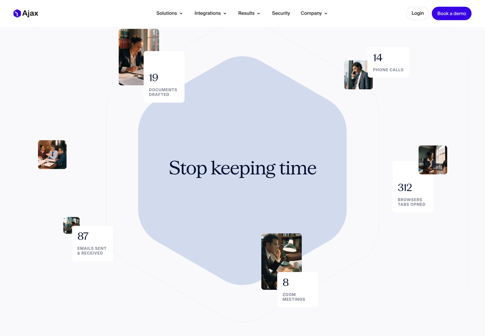
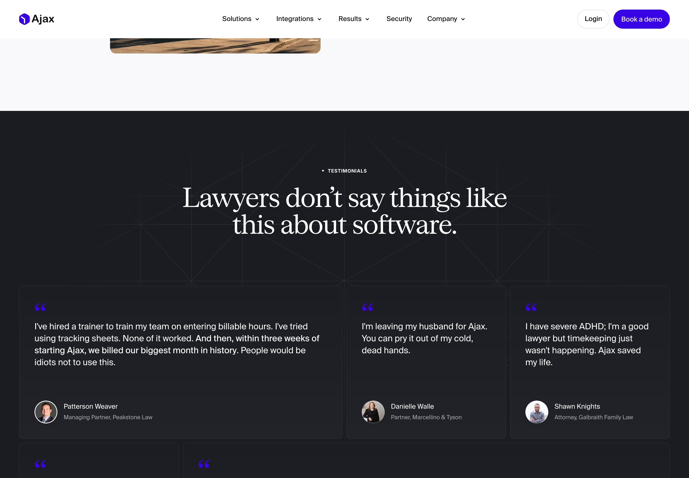
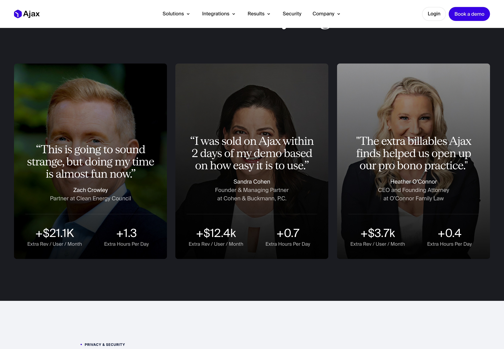
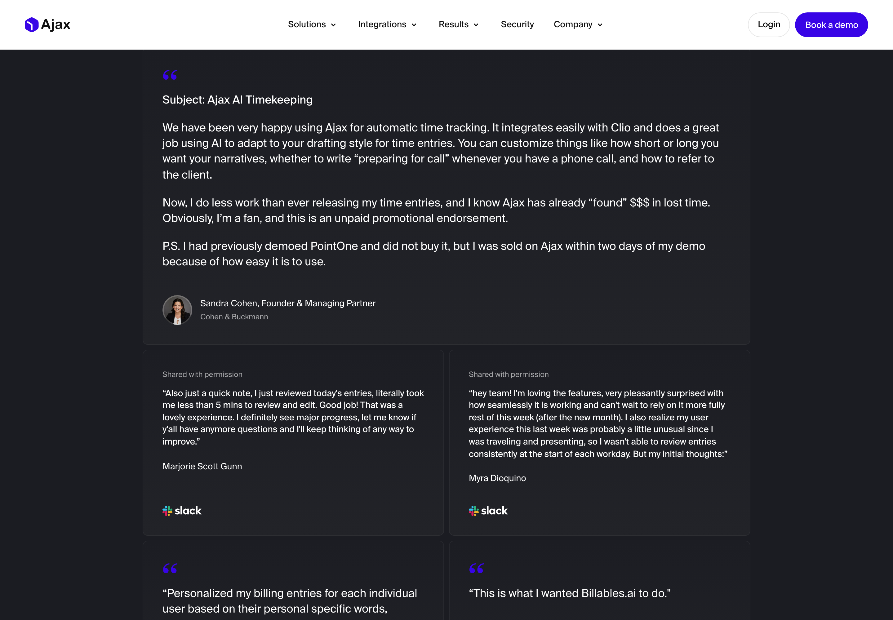
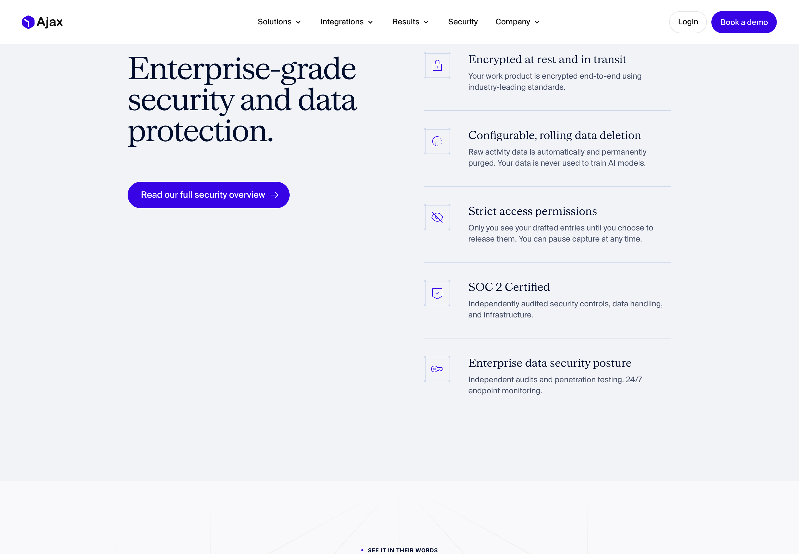
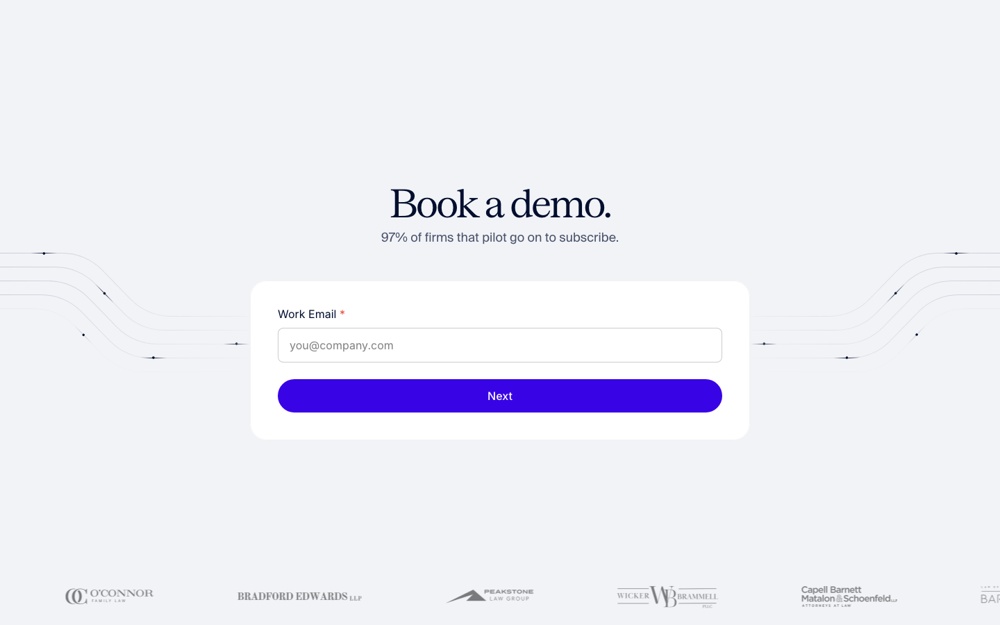
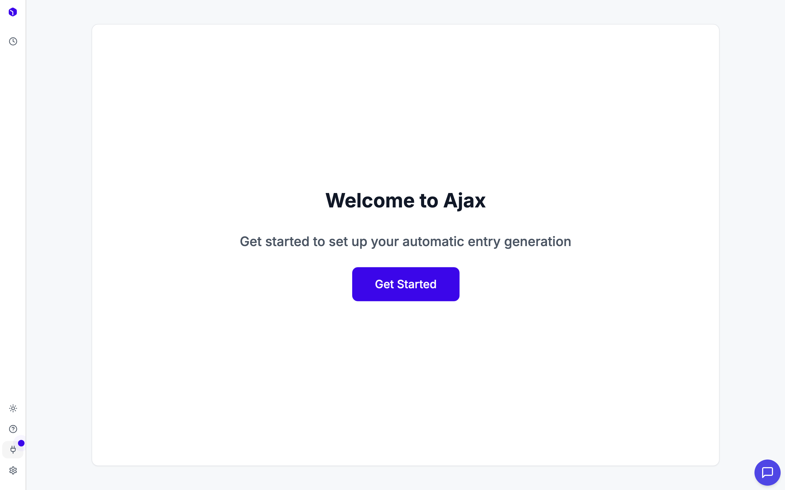
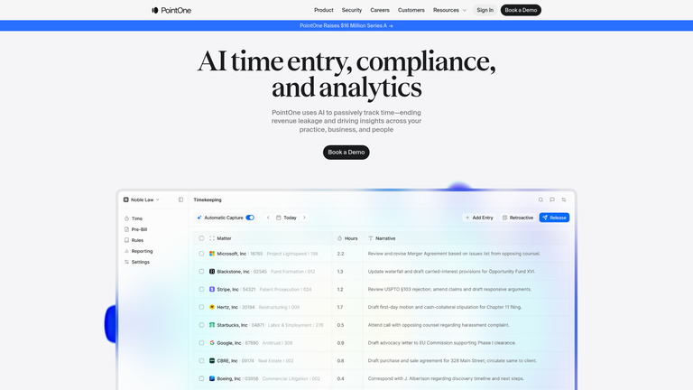
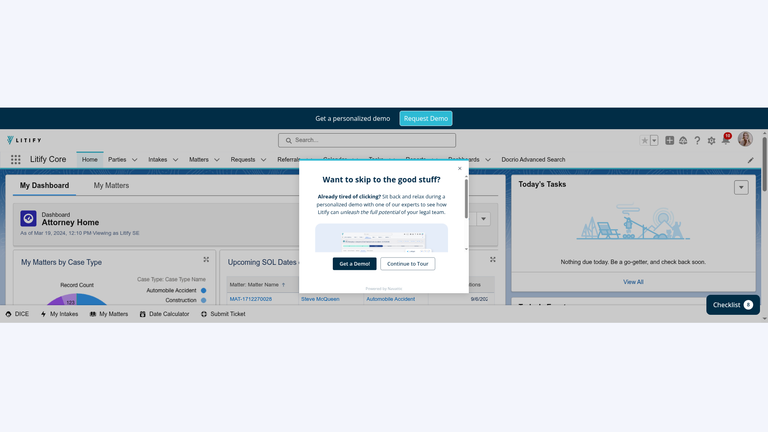

# Design Audit — joinajax.com (Ajax: AI Timekeeper for Lawyers)

*Audited 2026-06-29 · 14 public page types + mobile + logged-in product · screenshots captured via headed Chrome (Playwright). Templated families — ~17 case studies, ~30 blog posts — sampled by index + representative. In-product captured from a live authenticated session (read-only; no entries released/rejected).*

---

## TL;DR

**The marketing site is top-1% legal SaaS — editorial, confident, and built on the best social proof I've seen in the category. The product is functional and thoughtful but visibly under-branded next to it.** The single biggest opportunity isn't fixing the website — it's closing the *craft gap* between the marketing and the app, where the elegant serif brand collapses into a generic sans dashboard. Secondary: one social-proof stat (pilot→subscribe) is quoted as 90% / 95% / 97% across three pages — tighten it.

**Grade: Marketing A / A‑ · Product B‑**

---

## The big picture

Ajax is selling to the hardest B2B audience there is — skeptical, traditional, time-poor lawyers — and the marketing site is *engineered* for exactly that buyer:

- **Editorial serif identity** signals authority and craft (lawyers respond to it; most legal-tech looks like a 2014 dashboard).
- **A four-layer social-proof stack** (hero quote → text masonry → quantified results → video) that's unusually deep and unusually *real*.
- **Objection-first IA** — privacy, adoption, billing-system fit, "what about my personal activity" are all handled head-on.

Then you log in, and the same brand that felt like *Linear-for-lawyers* becomes a competent-but-ordinary internal tool: bold sans headings, a bare "Welcome to Ajax / Get Started" empty state, an icon-only sidebar, and a danger-red column for a benign "not connected yet" state. Nothing is broken — but the promise the site makes ("the timekeeper lawyers *want* to use") is a promise about *feel*, and feel is where the product trails the marketing.

That gap is the headline. Everything below supports it.

---

## What's working — keep doing this

### 1. The headline typography is the brand

*Hero — serif display with italic emphasis on "want," dark cinematic photography, and a live product card drafting a real billable entry (Meridian Capital — M&A, $850/hr, 1.4h).*

**Why it works:** the serif + italic is sophisticated and *category-defiant*. The hero doesn't just state the value — it **shows the output** (a drafted, narrated, priced time entry) floating over the photo. You understand the product in one glance. Keep the serif as the brand's load-bearing asset.

### 2. Copywriting does the selling
The product narrative is paired, memorable, and benefit-led:

- **"Stop keeping time." → "Start finding it."** — the two-section pairing is the best line on the site.
- **"Everything that keeps you from practicing law, handled."** — frames Ajax as removing everything that *isn't* lawyering.
- **"Stop losing time you already worked."** (timekeeping page) — clean loss-aversion.


*Activity (19 docs, 312 browser tabs, 87 emails, 8 Zoom calls) scatters around "Stop keeping time," then coalesces into captured entries in the next section. The visual literally animates the value prop.*

### 3. Social proof is the moat — and it's *real*

*"Lawyers don't say things like this about software" — then proves it: "I'm leaving my husband for Ajax," "People would be idiots not to use this," "I have severe ADHD… Ajax saved my life."*

**Why it works:** the headline pre-empts skepticism, then the testimonials over-deliver with names, firms, titles, and faces. Most SaaS social proof is laundered into blandness; Ajax kept the voice. Then it escalates:


*Results cards fuse a quote with hard ROI — +$21.1K extra revenue/user/month, +1.3 billable hrs/day — attributed to a named partner. This is the section that closes a managing partner.*

And the case-studies index surfaces the strongest trust signal on the whole site: **"14 customers liked Ajax so much, they angel invested."** Customers wiring you money is the highest-credibility endorsement that exists. Don't bury it.

### 4. The competitors page lets customers do the takedown

*Raw forwarded emails and Slack screenshots "shared with permission" — customers name PointOne and Billables.ai themselves ("I demoed PointOne and did not buy it… sold on Ajax in two days"; "This is what I wanted Billables.ai to do").*

**Why it works:** "18 comparisons, 18 firms chose Ajax" and a sports-style **18‑0 head-to-head record** is confident without being defensive, and routing the competitive knock through customer voices is far more credible than a vendor-built feature table. The real differentiation argument is also crisp: *competitors read metadata via APIs (subject lines, file names); Ajax reads actual content via a desktop app.*

### 5. Security is a first-class citizen

*On the landing page, not buried: "never used to train AI models," "only you see drafted entries until you release them," "pause capture anytime," SOC 2 — plus a dedicated "Book a Security Review" CTA on /security for the IT persona.*

**Why it works:** a tool that watches everything you do triggers an immediate privacy fear in a profession bound by confidentiality. Ajax addresses it *before* you can object — including the FAQ's "What if I work on personal stuff during the day?" That's deep empathy, and it's reinforced inside the product (the in-app Help page repeats the privacy highlights). This is the correct instinct, executed well.

### 6. The demo form removes friction

*One field — work email — then "Next." Progressive disclosure instead of a 7-field wall. Qualify later; capture intent now.*

---

## What's not working — fix this

### 1. The product doesn't look like the brand *(highest impact)*

*In-product onboarding: a bold **sans-serif** "Welcome to Ajax," one line of copy, one button, an ocean of white space. None of the marketing's serif, warmth, or craft made it across the login.*

**Why it's a problem:** you spent the entire funnel promising a premium, considered experience. The first authenticated screen has to *pay that off* — it's the moment trust converts to habit. Right now the app reads as a different, less-designed product. Three specific tells:

- **Type mismatch** — marketing is serif display; product is generic bold sans. The brand's single strongest asset is absent exactly where retention is decided.
- **Empty states are bare** — "Welcome to Ajax / Get Started" is a placeholder, not an onboarding. No preview of what "automatic entry generation" looks like, no steps, no momentum.
- **Icon-only sidebar** — four destinations with no labels. Discoverability rides on icon recognition. Your named competitor uses a labeled sidebar (see references).

### 2. The review board over-signals alarm
*The core in-product surface is a three-column board (To Review → Clio → Rejected) that mirrors the marketing's Capture→Review→Release story. Strong concept — but the unconnected Clio column wears a **red/danger border**, the same visual language as an error. (Live-account screenshot omitted from this shared version for privacy; the equivalent competitor layout is shown in the references below.)*

**Why it's a problem:** red = something's wrong. "You haven't connected Clio yet" is not wrong, it's a setup step. Use a neutral/dashed or amber "setup" treatment and a clear inline CTA, and reserve red for actual failure states. Two more notes on this screen:
- **Card density** — matter dropdown + code + hours + narrative + truncated source chips ("Get in o…", "Con…") + timeline, all per card. Powerful for provenance (a genuine strength — you can see *why* the AI wrote each entry), but heavy to scan in volume. Consider a denser table mode for power reviewers (this is what PointOne ships — see reference).
- **"Spam" as a billing classification** (in the toolbar and settings) is unconventional nomenclature for legal billing; "Non-billable" or "Discard" reads cleaner to the audience.

### 3. The polished part of the product proves the gap is fixable
*Settings is the best-designed in-product surface — two-pane layout, grouped sections, "Inherit firm default" badges (firm-vs-user policy hierarchy, genuinely sophisticated for legal), helper text phrased as plain questions. (Screenshot omitted here for privacy.)*

**Why it matters:** this screen shows the team *can* design at the marketing's level. The craft exists — it just hasn't been applied evenly across the app (board, empty states, nav). This is a distribution problem, not a capability problem.

### 4. One stat, three numbers
The pilot→subscribe proof point is quoted inconsistently:

| Page | Claim |
|------|-------|
| Landing hero | "Well over **90%** of firms that pilot subscribe" |
| Landing stats bar | "**95%** of firms that pilot subscribe" |
| Competitors hero | "**95%** pilot-to-paid conversion" |
| Book-a-demo | "**97%** of firms that pilot go on to subscribe" |

**Why it's a problem:** to a detail-oriented lawyer, three different numbers for the same metric reads as *loose with the truth* — the exact opposite of what your evidence-heavy strategy is going for. Pick one (95% appears most often), use it everywhere, and consider a one-line methodology footnote on the bold ROI claims ("11 days to pay for itself," "+$21.1K/user/mo") for the skeptics.

### 5. Minor marketing notes
- **Back-half length** — the landing is ~13,500px with four separate testimonial treatments. Justified for a considered legal purchase, but the bottom third (text masonry + results + video) is repetitive; could tighten by ~20% or gate the deepest proof behind "see more."
- **Footer is thin** — no trust-center link, status page, or social. For an enterprise security story, a visible "Trust Center" link belongs in the footer.
- **No pricing anywhere** — fully demo-led. Correct for the mid-market/enterprise motion, but adds friction for solo/small firms who self-qualify on price; a "starting at / how pricing works" note would catch them.
- **Stock gavel/scales** in the final CTA is more cliché than the original "lawyer-at-desk" hero photography. Replace with on-brand imagery or product.

---

## How the named competitor handles the same surface


*PointOne (the competitor Ajax customers cite by name) — **labeled** sidebar (Time, Pre-Bill, Rules, Reporting, Settings), an Automatic-Capture toggle, and a clean **tabular** entries view: Matter · Hours · Narrative, with client logos. [Lazyweb]*


*Litify (legal case management) — labeled top nav and a **guided onboarding modal** ("Want to skip to the good stuff? — Get a Demo / Continue to Tour") instead of a bare empty state. [Lazyweb]*

**Takeaway:** Ajax wins on marketing decisively, and its provenance-rich card (showing the source activity behind each entry) is a real product advantage PointOne's flat table lacks. But on two basics — **labeled navigation** and **guided first-run** — the competitor is ahead. These are cheap to match and directly affect adoption, which is the metric Ajax sells on.

---

## Prioritized recommendations

**1. Port the brand into the product (highest leverage).**
Bring the serif into product headings (page titles, empty states, onboarding), warm up the neutral grays toward the site's palette, and add the flow-line motif as a quiet texture. The app should feel like you walked through the same front door.

**2. Turn "Welcome to Ajax" into a real first-run.**
Replace the bare empty state with a 3–4 step guided setup + progress, and *preview the payoff* (a sample captured day) before any data exists.
```
┌───────────────────────────────────────────────┐
│  Welcome to Ajax — let's capture your day      │  ← serif
│                                                │
│  ●──────●──────○──────○                        │  ← progress
│  1 Install  2 Connect  3 Billing  4 Review     │
│  desktop    Clio       codes      your 1st day │
│                                                │
│  ┌── Preview: a day Ajax captured ──────────┐  │
│  │ 2.8  Meridian — M&A   Conference call…   │  │  ← show the
│  │ 3.2  Hargrove v.DuPont Reviewed depo…    │  │    value before
│  └──────────────────────────────────────────┘  │    empty
│            [ Connect your billing system → ]   │
└───────────────────────────────────────────────┘
```

**3. Fix the review board's color semantics + add a table mode.**
Neutral/amber "setup" state for unconnected billing (not red). Offer a compact table view for high-volume reviewers alongside the rich card view.
```
 To Review  ·  5 entries           Clio  (not connected)      Rejected
┌────────────────────────┐   ┌─ ─ ─ ─ ─ ─ ─ ─ ─ ─ ─┐   ┌──────────┐
│ 0.2 Meridian — M&A     │   │  ⚲ Connect Clio to    │   │  empty   │
│     Conference call…   │   │     route entries     │   │          │
│  ▸ source · timeline   │   │     [ Connect → ]     │   │          │
└────────────────────────┘   └─ ─ ─ amber/dashed ─ ─┘   └──────────┘
   [ ⊞ Cards · ▤ Table ]  ← density toggle for power reviewers
```

**4. Add labels to the sidebar** (or label-on-hover/expandable rail). Match the discoverability bar the competitor already clears.

**5. Standardize the pilot→subscribe stat** to one number sitewide, and footnote the boldest ROI claims with a one-line methodology.

**6. Tighten the landing's back third** (~20%) and add a footer **Trust Center** link.

---

## Method & file index

- **Public site:** 14 unique page types captured at 1440px (fold + full-page, scroll-triggered for Framer lazy sections) + mobile landing at 390px. Templated families (case studies, blog) sampled via index + representative.
- **In-product:** live authenticated session (`app.joinajax.com`), routes `/dashboard/timesheets`, `/integrations`, `/settings`, `/help`, captured read-only at 2×. Auth: PropelAuth. Account data is the owner's own dogfooding activity — critique is UX-only.
- **Screens:** `screens/` · **References:** `references/` (PointOne, Litify via Lazyweb) · this report: `report.md` / `report.html`.

*Note: screenshots of the live in-product account were intentionally omitted from this shared version for privacy; the in-product critique is unchanged.*
