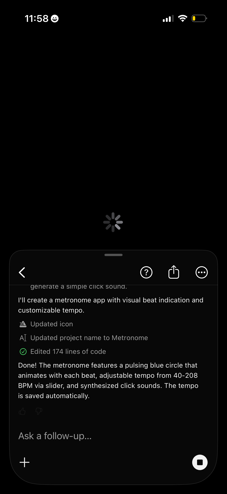

# Design Research: Queued Messages in LLM Chat Apps

## TL;DR
None of the big LLM chat apps (ChatGPT, Claude, Gemini, Copilot) ship native message queuing — the consistent native pattern is **disable send + show stop button** while streaming, and users have built a Chrome-extension cottage industry to fill the gap. The emerging "right answer" pattern, validated by ChatGPT Queue (extension) and Cursor (feature request hotly upvoted): let the user keep typing, hold pending messages **as ghost-styled bubbles right above the composer**, allow edit/delete before they fire, then drain the queue sequentially when streaming completes.

## Recommendations / Next Steps

1. **Always-typeable composer.** Never disable the textarea while streaming. Pressing Enter while a response is in flight should enqueue, not no-op. The send icon morphs into a "queue" icon (e.g. ⏱ or +) to signal the change in behavior. ChatGPT, Claude, and Gemini all currently *block* this — that's the gap to exploit.

2. **Queued messages live above the composer as ghost bubbles.** Don't insert them into the chat thread (that lies about send order and conflates "sent" with "queued"). Render them as a stack of muted/dashed-border user bubbles directly above the input, with each row showing the text, an edit pencil, and a delete X. This is the convention ChatGPT Queue established and what user requests on the OpenAI forum repeatedly describe.

3. **Stop ≠ Cancel queue.** The streaming stop button cancels the *current* generation only. Queued items should still fire. Provide a separate "clear queue" affordance (small × on the queue stack header) so users can abort the pipeline without aborting the current response — these are different intents.

4. **Drain visibly, not invisibly.** When streaming ends, animate the top queued bubble *sliding down* into the chat as the new user turn, then watch the assistant start replying. The motion teaches the user that "queued → sent → answered" is a deterministic pipeline. Silent insertion makes queued messages feel lost.

5. **Per-message status icons (small).** Inside each queued bubble, a tiny status glyph: ⏱ queued, ↑ sending, ⏵ streaming response. Keep them subtle — the bubble's *position* (above composer vs. in thread) is already 90% of the signal. iMessage solved this with a single character (•••).

6. **Cap the queue and warn at the limit.** 5 queued messages is plenty. After that, show a one-line warning ("queue full — wait for response or remove items"). Unbounded queues invite users to type stream-of-consciousness, then get a wall of robotic answers they didn't actually want.

7. **Make queued context visible in the prompt sent to the model.** Optional but powerful — when message #2 fires, you can prepend a note like *"User also queued these follow-ups while you were responding: …"*. Lets the model batch or reorder if it's smart enough. Cursor's agent best-practices docs hint at this.

### ASCII: composer states

**Idle:**
```
┌──────────────────────────────────────────────┐
│ Ask anything…                            [↑] │
└──────────────────────────────────────────────┘
```

**Streaming, queue empty (today's status quo):**
```
  Assistant: Lorem ipsum dolor sit amet, conse▌
  ────────────────────────────────────────────
┌──────────────────────────────────────────────┐
│ Type to queue a follow-up…              [■] │ ← stop streaming
└──────────────────────────────────────────────┘
```

**Streaming, with 2 queued messages (proposed):**
```
  Assistant: Lorem ipsum dolor sit amet, conse▌
  ────────────────────────────────────────────
  ┌─ Queue (2) ────────────────────── clear × ┐
  │ ┌──────────────────────────────────────┐  │
  │ │ ⏱ also explain the time complexity  ✎×│  │ ← ghost bubble, muted bg, dashed border
  │ └──────────────────────────────────────┘  │
  │ ┌──────────────────────────────────────┐  │
  │ │ ⏱ and rewrite it in Rust            ✎×│  │
  │ └──────────────────────────────────────┘  │
  └──────────────────────────────────────────  ┘
┌──────────────────────────────────────────────┐
│ Add another…                            [⏱] │ ← send becomes "enqueue"
└──────────────────────────────────────────────┘
                         [■] stop current response (separate)
```

**Just drained (msg #1 sliding into thread):**
```
  Assistant: …final paragraph done.
  You: also explain the time complexity   ← slid in from queue
  Assistant: ▌                             ← starts immediately
  ────────────────────────────────────────────
  ┌─ Queue (1) ──────────────────────────────┐
  │ ⏱ and rewrite it in Rust            ✎ × │
  └──────────────────────────────────────────┘
```

## Key Examples


*Bitrig (mobile) — Mid-stream state with typing spinner and an inline stop/cancel button in the composer. Composer is still typeable, which is the prerequisite for any queueing behavior. The status updates above ("updated icon", "renamed project", "edited code") double as a progress log so the user knows *what* they'd be queueing on top of. [Lazyweb]*

## Patterns

**Universal in 2026 native LLM chats** (ChatGPT, Claude, Gemini, Copilot, Perplexity):
- Send button morphs into stop (■) the moment streaming begins.
- Textarea remains editable but Enter is a no-op until streaming ends. *(This is the friction users are complaining about.)*
- The assistant's in-progress bubble shows a caret/cursor blink or shimmer to signal liveness.
- No queue, no buffer — if you press Enter early it's lost.

**Common across queue-enabling extensions and agent IDEs (ChatGPT Queue, Cursor, agentic coding tools):**
- Queue appears *above* the composer, not in the thread.
- Per-item edit + delete affordances.
- Sequential drain (FIFO).
- Visual differentiation from sent messages: dashed border, lower opacity, or distinct background.

## Anti-Patterns

- **Disabling the textarea entirely.** Kills flow-of-thought capture. The whole point of a queue is "I had another idea — let me get it down before I forget."
- **Inserting queued messages into the chat thread immediately.** Confuses send order and breaks the model's view of conversation. Don't do this even with a "pending" label — visual proximity to real messages is too misleading.
- **Auto-merging queued messages into one big prompt.** Tempting, but it changes the user's intent. Two separate questions ≠ one combined question to the model. Send sequentially.
- **Silent queue drain.** If the message just appears in the thread, users wonder if they accidentally sent it again. Animate the transition.
- **Hiding queue length.** Always show count. A queue of 4 you forgot about is worse than no queue.
- **Treating "stop generating" and "clear queue" as the same control.** Different intents, different buttons. Conflating them means users either cancel work they wanted or pile up work they wanted cancelled.

## Unique Angles

- **Cursor's "background agent" framing.** Cursor treats long-running agent tasks as something you walk away from — so queued messages double as a backlog you populate while the agent works, not just an impatience-tax. Reframing queue as *intentional planning* (vs. *waiting room*) opens different UI patterns: numbered todos, drag-to-reorder, even a "send all as one plan" merge button as an explicit user choice.
- **The status-log composer.** Bitrig (above) blends progress events ("renamed project", "edited code") into the area right above the composer. If you're queueing follow-ups, this context is exactly what you want visible while typing — you can write "also do X *to that newly renamed file*" with the relevant fact still on screen.
- **Cap the queue, not just for UX but for cost.** ChatGPT extensions don't do this; you should. Each queued message becomes a full turn with the model — easy way for a user to run up a $5 bill in 30 seconds by mashing Enter on an Opus chat.

## Findings

The research landscape is asymmetric: **near-zero native support, heavy unmet demand**.

- OpenAI forum thread "Feature Request: Message queue while GPT is generating responses" remains open and active in 2026.
- Cursor's "Queue Agent Messages" feature request is a recurring forum thread (the canonical URL 404s now but the feature is referenced across docs and dev guides — Cursor has partially shipped it as "Add follow-up").
- Multiple Chrome extensions (ChatGPT Queue, ChatGPT Message Queue, queue-chatgpt on GitHub) exist specifically to retrofit this onto ChatGPT.
- The Lazyweb screenshot corpus has **no clean examples of queued state in any major LLM chat** — the corpus is full of marketing pages, empty inboxes, and streaming-with-stop states, but nothing showing a "ghost bubble above composer waiting to send." That absence is itself the finding: this is greenfield UX.

Adjacent precedent worth borrowing:
- **iMessage's send-while-offline behavior**: outbox messages render in the thread but greyed out with a small clock icon. Closest mainstream precedent — but it inserts into the thread, which we argued against above. Lift the visual treatment (muted color, status glyph) without lifting the placement.
- **Slack's draft system**: typing in a channel persists as a draft with a small badge. Different problem (drafts, not queue) but the *visibility model* (small indicator near input, not in thread) is what we want.
- **Email outbox**: long-established pattern of "queued, will send when you reconnect." LLM chat queues are the same primitive applied to a different bottleneck (model latency instead of network).

The strongest pattern recommendation — ghost bubbles above composer with edit/delete — is what ChatGPT Queue extension users have already validated by adoption. The big LLM apps are leaving an obvious flow-of-thought win on the table.

## Sources

- [Create a UI for queued chat like ChatGPT and Claude — learnersbucket](https://learnersbucket.substack.com/p/create-a-ui-for-queued-chat-like)
- [Feature Request: Message queue while GPT is generating responses — OpenAI Developer Community](https://community.openai.com/t/feature-request-message-queue-while-gpt-is-generating-responses/1155949)
- [Queue up messages for ChatGPT — OpenAI Developer Community](https://community.openai.com/t/queue-up-messages-for-chatgpt/741089)
- [ChatGPT Message Queue (Chrome extension)](https://chromewebstore.google.com/detail/chatgpt-message-queue/bdeaocefmnkeinfiknfeahpghemjjgjo)
- [ChatGPT Queue — Save Time with Prompt Chains and Bulk Prompting (Chrome extension)](https://chromewebstore.google.com/detail/chatgpt-queue-save-time-w/iabnajjakkfbclflgaghociafnjclbem)
- [queue-chatgpt (GitHub)](https://github.com/gstohl/queue-chatgpt)
- [AI Chat UI Best Practices: Designing Better LLM Interfaces — thefrontkit](https://thefrontkit.com/blogs/ai-chat-ui-best-practices)
- [Best practices for coding with agents — Cursor](https://cursor.com/blog/agent-best-practices)
- [Chat Interface Patterns — Agentic Design](https://agentic-design.ai/patterns/ui-ux-patterns/chat-interface-patterns)
- [Agent UX Patterns: Chat-First UX Fails — Hatchworks](https://hatchworks.com/blog/ai-agents/agent-ux-patterns/)
- [Design Patterns For AI Interfaces — Smashing Magazine](https://www.smashingmagazine.com/2025/07/design-patterns-ai-interfaces/)
