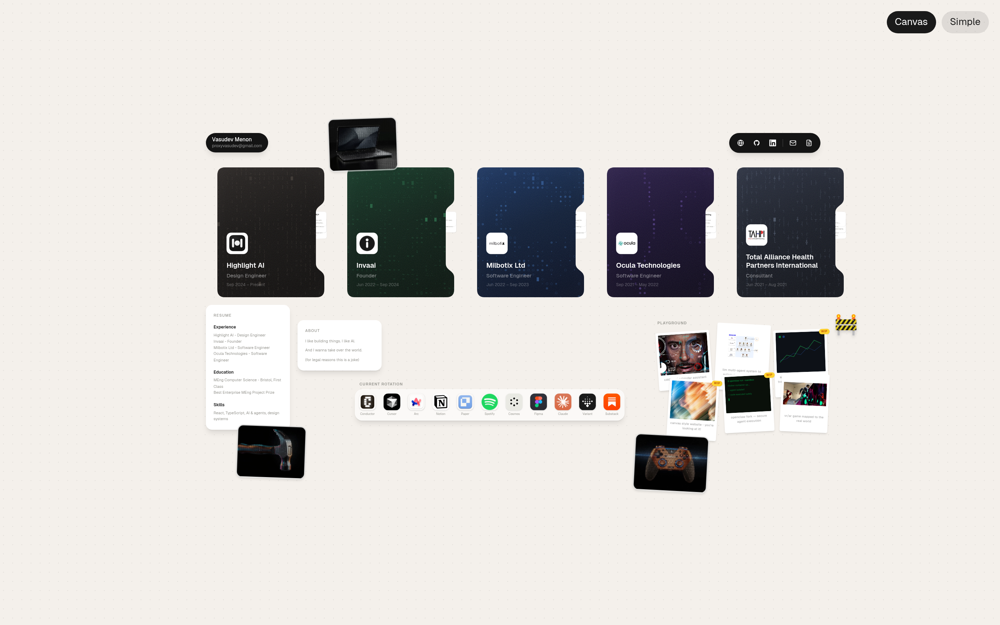
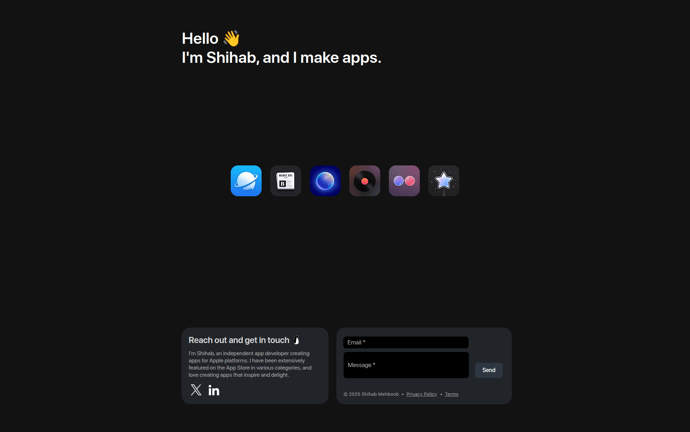
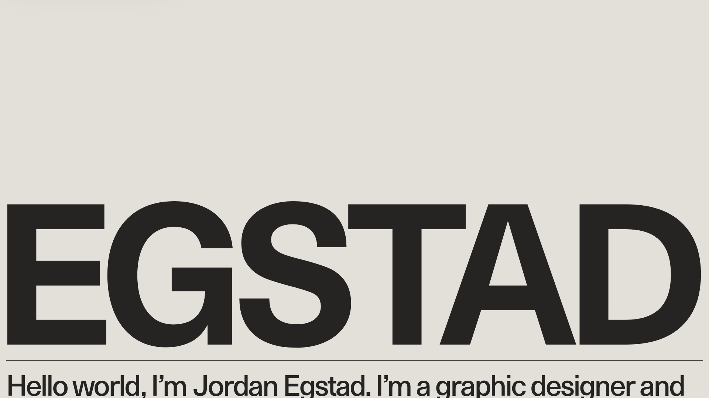
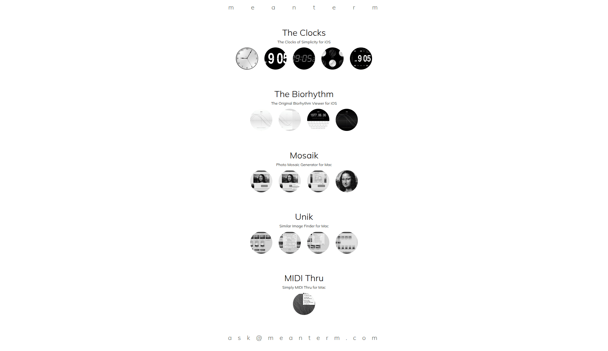
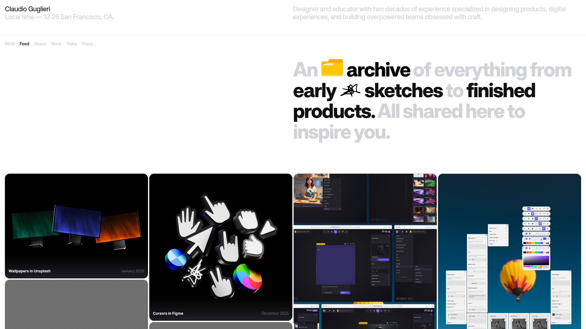
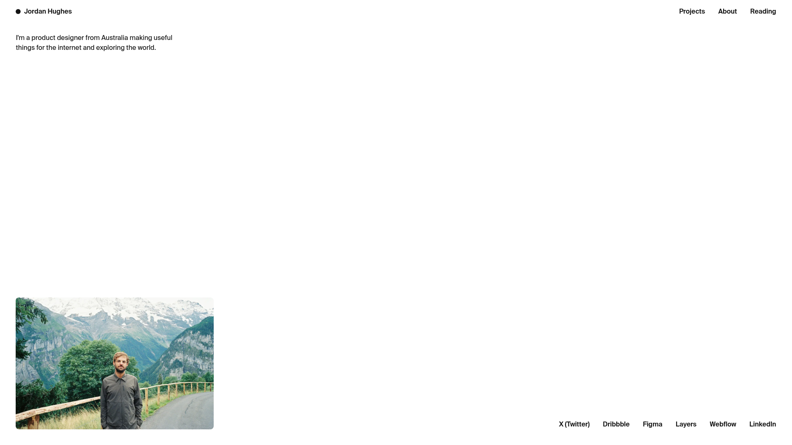
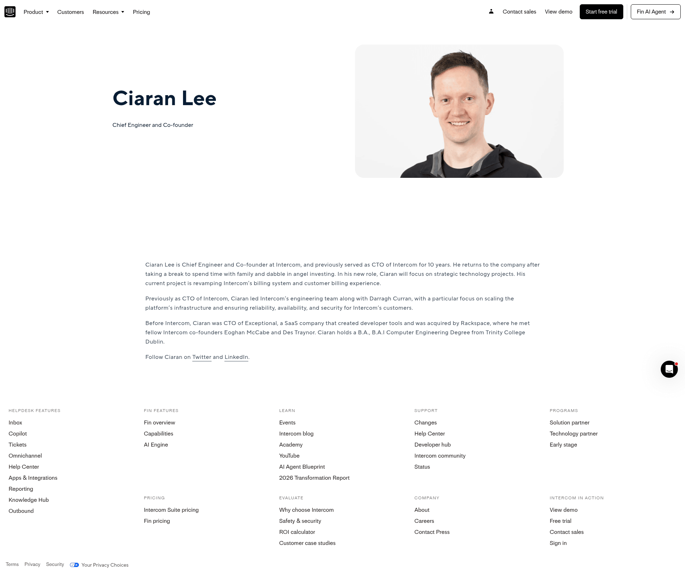

# Design Audit: vasudevmenon.com

## TL;DR
The site is a beautifully crafted canvas — custom cursor, tilt, magnifying dock, intro burst — but a first-time visitor lands and can't tell **who you are or what you do** without clicking. Five near-identical dark folder cards dominate the viewport while your name sits as a tiny pill in the corner. The single biggest lift: a visible identity statement at the top of the canvas so the work has someone to belong to.

## Current State


*vasudevmenon.com canvas — captured at 1440×900. Five experience folders dominate the middle band, the dock floats between them, your name appears as a small pill top-left, and project artifacts (polaroids, controller, video tile) cluster around the edges. The Canvas/Simple toggle is the only obvious affordance.*

## Improvement Ideas

### 1. Give yourself a hero ⭐ (highest impact)

Right now the "vasudev menon" pill is so small it reads as a logo for the dock UI, not as the person behind the site. Three of the four most-similar references hit you with name + role within the first second.

**Inspired by:**


*pnguin.app — `Hello 👋 / I'm Shihab, and I make apps.` placed top-left in display weight. [Lazyweb]*


*egstad.com — name set huge across the viewport on a near-identical warm cream background. The name IS the hero. [Lazyweb]*

**Why this works:** Both visitors and recruiters need to answer "who is this and why am I here?" in under a second. You already have the line in `data/profile.ts` ("Design engineer building AI-native products…"). Move it onto the canvas itself, not behind a card click.

**Sketch:**
```
┌──────────────────────────────────────────────────────────┐
│  vasudev menon                          [Canvas][Simple] │
│  design engineer · ai-native products                    │
│                                                          │
│   ┌────┐ ┌────┐ ┌────┐ ┌────┐ ┌────┐                    │
│   │ HL │ │ IN │ │ MB │ │ OC │ │ TA │   (experiences)    │
│   └────┘ └────┘ └────┘ └────┘ └────┘                    │
│                                                          │
│         ┌─────────── DOCK ────────────┐                  │
│         └─────────────────────────────┘                  │
└──────────────────────────────────────────────────────────┘
```

Keep the cute pill — but add the tagline beneath it in Instrument Serif italic to leverage the editorial font already in your scale.

---

### 2. Anchor the dock to the bottom

The dock currently floats roughly mid-canvas. Anyone with a Mac expects a dock at bottom-center; placing it in the middle reads as "decoration that looks like a dock" instead of "the dock, your nav." It also fights the experience cards for vertical real estate.

**Inspired by:** macOS itself — and your own metaphor. The dock and the warm-paper background are the strongest identity signals you have; let the dock occupy its natural spot.

**Why this works:** Bottom-anchored docks free the middle band for content, signal "this is interactive" via convention, and let the magnification effect feel earned (because it's where users instinctively send their cursor).

**Sketch:**
```
┌──────────────────────────────────────────────────────────┐
│  vasudev menon  → tagline                                │
│                                                          │
│   experience row · projects · about                      │
│                                                          │
│                  (breathing room)                        │
│                                                          │
│             ┌─[ DOCK · centered · floats ]─┐             │
└─────────────└────────────────────────────────┘──── 20px ─┘
```

---

### 3. Differentiate the five experience cards

The five company cards read as a row of near-identical dark folders. The per-company colour theming (charcoalGrid, forest, royal, midnightDots, slate) is too subtle on first look — at thumbnail size most viewers can't tell them apart, so they don't bother scanning.

**Inspired by:**


*meanterm.com — each project gets a full row: name, tagline, distinct circular icons. Nothing competes. [Lazyweb]*

**Why this works:** You could (a) make logos / wordmarks ~2× larger so Highlight AI, Invaai etc. are recognisable at thumbnail size, (b) lift the company tint from ~5% to ~25% of the card so each card has a clear "this is the green one / blue one" cue, or (c) reduce the row from 5 cards to 3 visible + a "+2 more" affordance so each card gets more space. Pick the cheapest one.

**Sketch:**
```
Before:           After (option B — stronger tint):
┌─┐ ┌─┐ ┌─┐       ┌─┐ ┌─┐ ┌─┐ ┌─┐ ┌─┐
│⬛│ │⬛│ │⬛│       │HL│ │🟢│ │🔵│ │🟣│ │⚫│
└─┘ └─┘ └─┘       └─┘ └─┘ └─┘ └─┘ └─┘
all dark         each card visibly distinct
```

---

### 4. Promote the projects out of the margins

Your standalone projects (the polaroid scatter, the controller image, the dot-matrix video) are some of the most visually interesting content on the canvas — but they sit in the bottom-right corner and at thumb size compared to the experience row. They read as decoration.

**Inspired by:**


*guglieri.com — designer's portfolio leads with a feed grid of work thumbnails at meaningful size, with a single editorial line "An archive of everything from early sketches to finished products." [Lazyweb]*

**Why this works:** Recruiters and peers care about *what you've shipped*, not just *where you've worked*. Either give projects their own labeled band ("Selected work" header, scale up the polaroids), or rebalance so the project zone is a peer to the experience row, not a footer.

---

### 5. Add a "you can interact with this" hint

A new visitor staring at the canvas right now has no signal that things are draggable, hoverable, or zoomable. The custom cursor flips on hover, but only after they've already moved their mouse over something — and most users skim with their eyes first. The Canvas / Simple toggle is the only visible affordance.

**Inspired by:**


*jordanhughes.co — sparse but every clickable region (Projects, About, Reading, social row) is in plain sight. Visitor never has to guess. [Lazyweb]*

**Why this works:** You don't need to abandon the canvas metaphor — just add one small hint. Options, cheapest first: (a) a faint "drag · click · explore" line near the dock, (b) a one-time tooltip that points at one card on first load, (c) a subtle pulse on one card after 3 s of idle. Pick (a).

## What's Working

Don't change these — they're what makes the site memorable:

- **The warm linen background** (`#f4f0eb`). Distinctive, calm, makes you stand out from the wall of dark-mode portfolios.
- **The custom cursor + tilt + dock magnification.** Each, alone, is a craft signal. Together they read "this person ships polished UI."
- **The intro burst → artifacts settle sequence.** Unique entrance moment. Don't lose this — just make sure the *final* state (post-intro) carries identity (idea 1).
- **The Canvas / Simple two-tier architecture.** Smart inclusive design. Most portfolios miss this entirely.
- **The font pairing (Geist + Instrument Serif).** Editorial serif callouts in italic give the page a personal voice without needing more copy. Use it for the tagline (idea 1).

## All References

| | Source | Pattern | Provenance |
|---|---|---|---|
|  | [pnguin.app](https://www.pnguin.app/) | Top-left hello + name + role in display text | [Lazyweb] |
|  | [egstad.com](https://egstad.com/) | Name as massive type on warm cream background | [Lazyweb] |
|  | [jordanhughes.co](https://jordanhughes.co/) | Single-line bio top-left, visible nav, person photo, social row | [Lazyweb] |
|  | [meanterm.com](https://meanterm.com/) | Each project gets a full breathing row with distinct icons | [Lazyweb] |
|  | [guglieri.com](https://guglieri.com/feed) | Work feed as hero with editorial tagline | [Lazyweb] |
|  | [intercom.com/about/ciaran-lee](https://www.intercom.com/about/ciaran-lee) | Founder profile with categorized content sections — alternative to canvas if you ever want a simpler default | [Lazyweb] |

